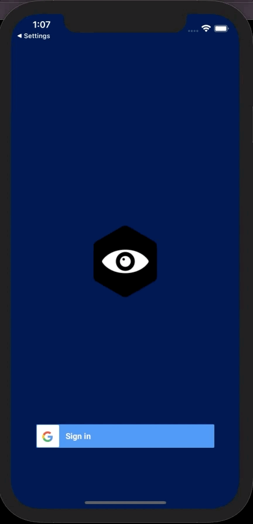
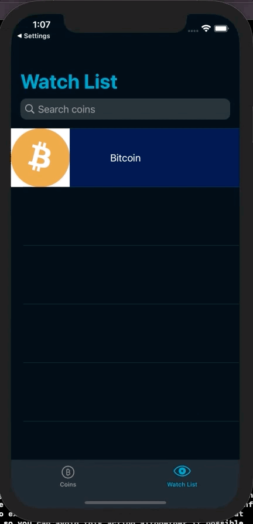

# CryptoWatch
An iOS app that authenticates users with their Google account and saves crypto they are watching.
## Demo
### Authentication

### Add crypto to watch list

### Watch List

## How It Works
* Users authenticate with their Google account using Firebase
* Network calls are made to [CoinAPI](https://www.coinapi.io/)
* The CoinCollectionController will have a collectionview populated by the list of crypto available from CoinAPI
* Users can save a coin they are watching into their watch list using Core Data
## Tools
* Core Data
* [CoinAPI](https://www.coinapi.io/)
* [Kingfisher](https://github.com/onevcat/Kingfisher)
* [Snapkit](https://github.com/SnapKit/SnapKit)
